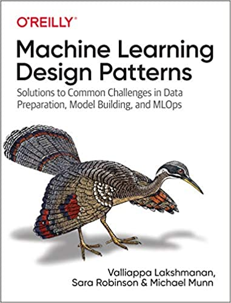

*This is not an official Google product*

# ml-design-patterns
Source code accompanying O'Reilly book:  
**Title**: Machine Learning Design Patterns  
**Authors**: Valliappa (Lak) Lakshmanan, Sara Robinson, Michael Munn  

 https://www.oreilly.com/library/view/machine-learning-design/9781098115777/ </img>  

<a href="https://shop.aer.io/oreilly/p/machine-learning-design/9781098115784-9149">Buy from O'Reilly</a>  
<a href="https://www.amazon.com/Machine-Learning-Design-Patterns-Preparation/dp/1098115783">Buy from Amazon</a>  

We will update this repo with source code as we write each chapter. Stay tuned!

# Chapters

* Preface
* The Need for ML Design Patterns
* Data representation design patterns
  * #1 Hashed Feature
  * #2 Embedding
  * #3 Feature Cross
  * #4 Multimodal Input
* Problem representation design patterns
  * #5 Reframing
  * #6 Multilabel
  * #7 Ensemble
  * #8 Cascade
  * #9 Neutral Class
  * #10 Rebalancing
* Patterns that modify model training
  * #11 Useful overfitting
  * #12 Checkpoints
  * #13 Transfer Learning
  * #14 Distribution Strategy
  * #15 Hyperparameter Tuning
* Resilience patterns
  * #16 Stateless Serving Function
  * #17 Batch Serving
  * #18 Continuous Model Evaluation
  * #19 Two Phase Predictions
  * #20 Keyed Predictions
* Reproducibility patterns
  * #21 Transform
  * #22 Repeatable Sampling
  * #23 Bridged Schema
  * #24 Windowed Inference
  * #25 Workflow Pipeline
  * #26 Feature Store
  * #27 Model Versioning
* Responsible AI
  * #28 Heuristic benchmark
  * #29 Explainable Predictions
  * #30 Fairness Lens
* Summary
